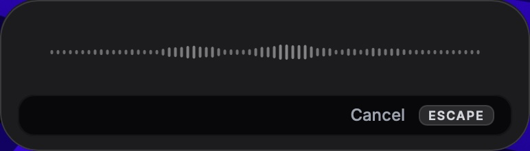
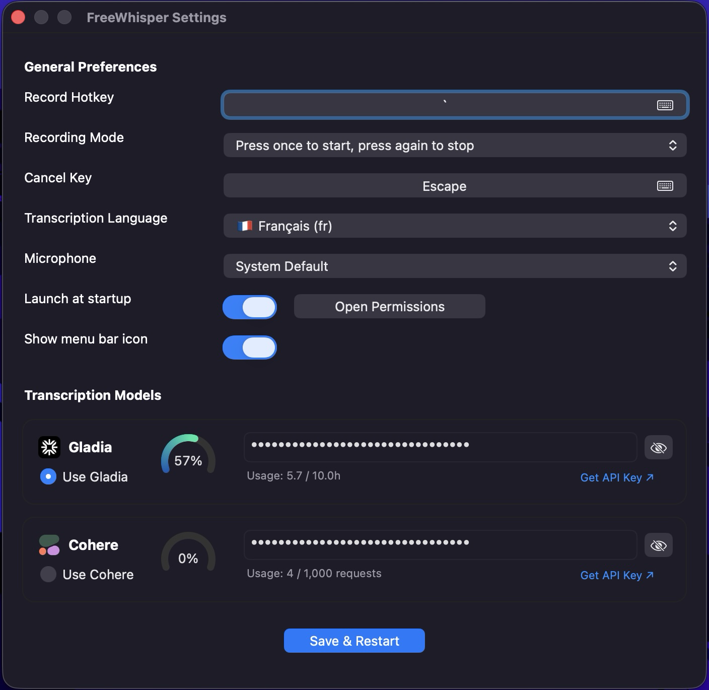

# FreeWhisper

FreeWhisper is a lightweight macOS menu bar app for instant speech-to-text dictation.
Press a hotkey, speak, release, and your words land where your cursor is.

## Why FreeWhisper

Many speech-to-text apps are either:
- expensive cloud products with recurring subscriptions
- local open-source setups that require model downloads, runtime tuning, and more maintenance than most people want for simple dictation

FreeWhisper is built for a different tradeoff: a clean native Mac experience, fast setup, and access to strong cloud transcription providers that still offer a realistic free starting point.

At the time of writing:
- Gladia says its Starter plan includes 10 free transcription hours per month, plus real-time transcription support
- Cohere says trial API keys are free, with usage and rate limits during the trial period

That makes FreeWhisper a very strong free or low-cost alternative to many paid cloud dictation tools, while staying dramatically easier to start with than most local speech-to-text stacks.

If you want fully offline transcription and full local control, local open-source models are still great. FreeWhisper is for the opposite goal: the easiest way to get excellent dictation on macOS without turning setup into a side project.

Pricing, limits, and free-tier details can change. Check the official provider pages before depending on them long term:
- [Gladia pricing](https://www.gladia.io/pricing)
- [Gladia pricing details](https://support.gladia.io/article/understanding-our-transcription-pricing-pv1atikh8y9c8sw7sudm3rcy)
- [Cohere trial keys and rate limits](https://docs.cohere.com/docs/rate-limits)

## Features

- Native macOS menu bar app with no Dock icon
- Global hotkey dictation
- Two recording modes: hold to record, or press once to start and again to stop
- Floating waveform overlay while recording
- First-class support for both Gladia and Cohere
- Direct text insertion at the cursor, with clipboard fallback when needed
- Native Settings window for hotkeys, language, provider selection, startup behavior, and menu bar visibility
- Optional launch at login
- Standalone `.app` build for non-technical users

## Interface

FreeWhisper is designed around three simple surfaces:
- Menu bar control
- Recording overlay
- Native Settings window

### Overlay



### Menu Bar


### Settings



## Install

The recommended path for most users is the standalone app bundle.

1. Download the latest `FreeWhisper.app.zip` from the GitHub Releases page.
2. Unzip it.
3. Drag `FreeWhisper.app` into `/Applications`.
4. Open `FreeWhisper.app`.
5. If macOS warns that the app cannot be verified, right-click the app, choose `Open`, then confirm once.
6. Open `Settings` from the menu bar item and add your Gladia and/or Cohere API key.

## First Launch Permissions

FreeWhisper needs a few macOS permissions to work correctly:

| Permission | Why it is needed |
|---|---|
| Accessibility | Detects text fields and inserts transcriptions at the cursor |
| Input Monitoring | Listens for your global hotkey |
| Microphone | Records your voice |

You can manage these in:
`System Settings > Privacy & Security`

## How It Works

1. Press your recording hotkey.
2. Speak.
3. Release the hotkey, or press it a second time if you use toggle mode.
4. FreeWhisper sends the audio to your selected provider.
5. The transcription is inserted into the active text field, or kept in the clipboard if direct insertion is not possible.

Press `Escape` to cancel a recording without inserting anything.

## Providers

### Gladia

- Real-time transcription over WebSocket
- Great fit for fast dictation workflows
- Supports auto language detection and switching
- Good default if you want the most “live” dictation feel

### Cohere

- Simple transcription flow inside the same app
- Great alternative provider if you prefer Cohere's platform
- Easy to keep as a second backend in Settings
- Useful if you want one app with multiple cloud options instead of committing to a single provider

## Data and Config

The standalone app stores its user data in standard macOS locations:

- Config: `~/Library/Application Support/FreeWhisper/config.json`
- Logs: `~/Library/Logs/FreeWhisper/debug.log`

That means the app bundle can live in `/Applications` like a normal Mac app, while your settings stay in your user account.

## Build From Source

If you want to run or modify the app from source:

```bash
git clone https://github.com/YOUR_USERNAME/FreeWhisper.git
cd FreeWhisper
chmod +x setup.sh
./setup.sh
./run.sh
```

To rebuild the standalone app bundle locally:

```bash
python3 build_standalone_app.py
```

## Tech Stack

- Python
- PyObjC / AppKit
- `rumps` for menu bar integration
- Gladia API
- Cohere API

## License

MIT License. See [LICENSE](LICENSE).
